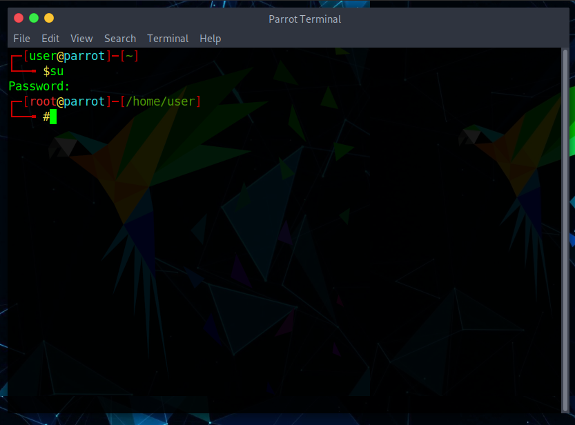

# Customize linux terminal like ParrotOS

1. Navigate to your Home folder and r-click then find the option "Open in Terminal" or something like that.
2. Write in the terminal to copy the file and open with any text editor you prefer. e.g. below.

~~~
sudo cp .bashrc .bashrc-copy && nano .bashrc
~~~

3. Remove the existing script and copy the code from the repository and paste it then save.
4. Close all active terminal then open a new one, and you'll seeee Wallllaaaaaahhhh!
5. Done.

    

